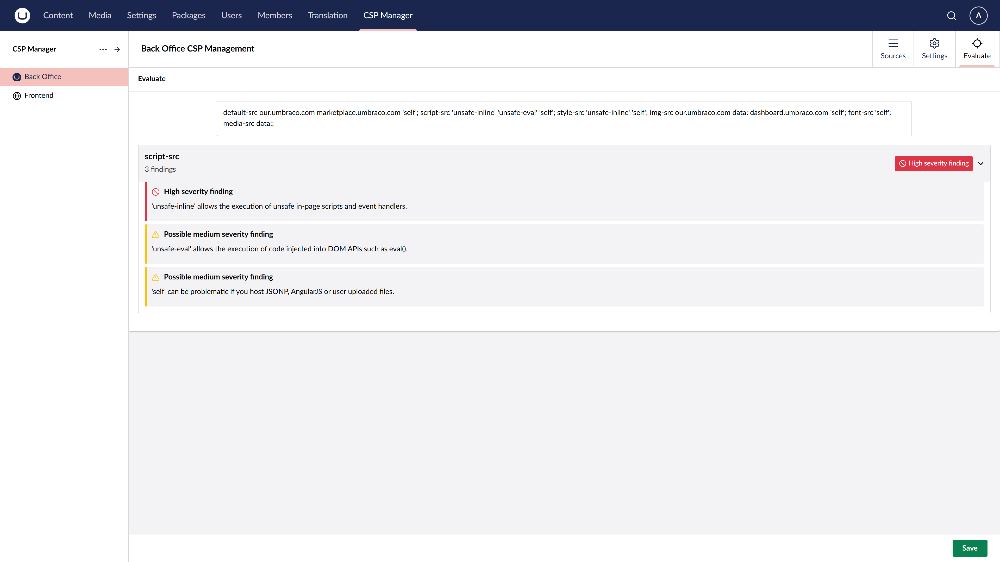

# Evaluation Tool

The built-in evaluation tool analyses your current CSP configuration and highlights potential security issues — such as overly permissive sources or directives that could allow XSS attacks.

## Using the Evaluation Tool

Navigate to the **CSP Management section** in the backoffice and select the **Evaluate** tab. The tool will:

1. Parse your current policy configuration
2. Identify directives or sources that weaken security (e.g., `'unsafe-inline'`, `'unsafe-eval'`, wildcard `*` sources)
3. Provide guidance on safer alternatives

Use this tool to validate your policy before switching from report-only to enforcing mode.
