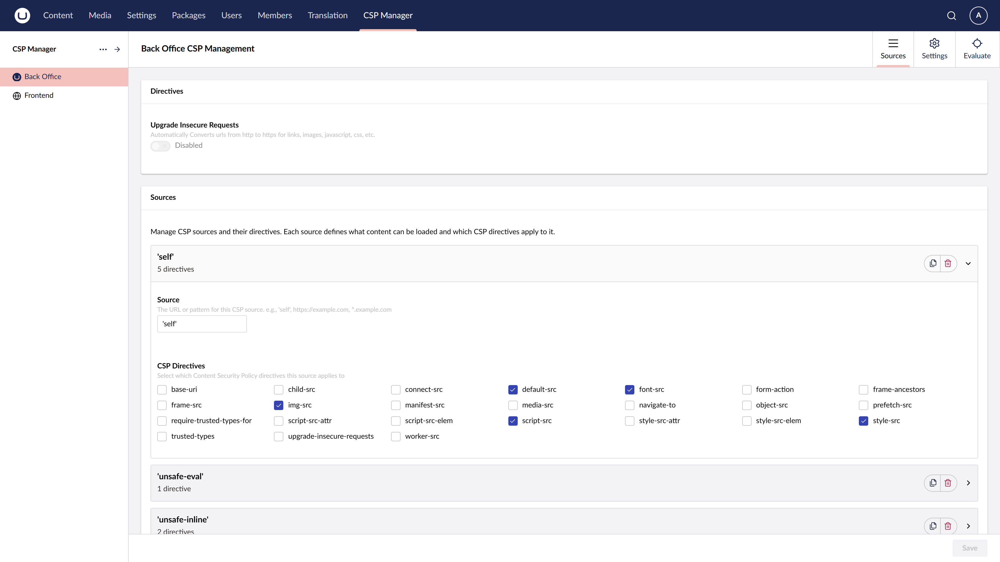

# Policy Management

The CSP Manager provides an intuitive interface for managing Content Security Policy directives. CSP Manager maintains two separate policies:

- **Frontend** — applies to your public-facing website
- **Backoffice** — applies to the Umbraco administration interface

Navigate to the **CSP Management section** in the Umbraco backoffice sidebar to manage both.

## Managing Sources

The UI groups configuration by source first, then lets you select which directives apply to each source. This approach means the same source can cover multiple directives, and different sources can target the same directive.

To add a new source:
1. Click **Add source**
2. Enter the source value (e.g., `https://cdn.example.com`, `'self'`, `'unsafe-inline'`)
3. Select which CSP directives this source applies to
4. Save your changes

## Special Sources

Some CSP keywords require quotes in the source value. Enter them exactly as they appear in the CSP specification, including the single quotes.

### strict-dynamic

To add `'strict-dynamic'` to your CSP:
1. Navigate to the Policy Management section
2. Add a new source entry with the value `'strict-dynamic'`
3. Select the directive(s) you want to apply it to (typically `script-src`)
4. Save your configuration

Other keyword sources follow the same pattern — for example `'self'`, `'unsafe-inline'`, `'unsafe-eval'`, `'sha256-abc123...'`.
