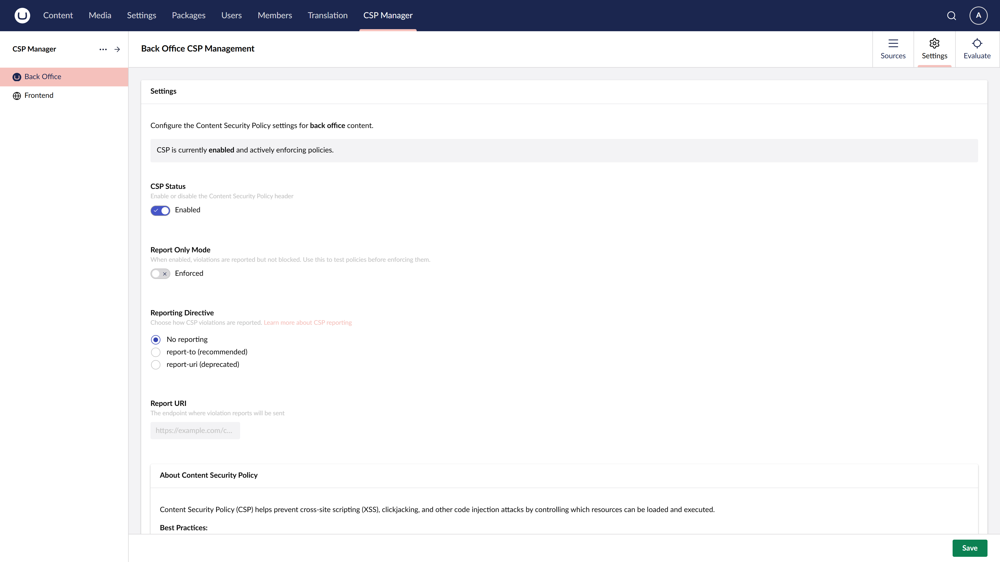

# Policy Settings

Each policy (frontend and backoffice) has settings that control how the CSP header is sent.

{: width="3840" height="2160" }

## Enabled

Toggles whether the CSP header is sent for this policy. When disabled, no `Content-Security-Policy` or `Content-Security-Policy-Report-Only` header is added to responses.

## Report Only

When enabled, the policy is sent as `Content-Security-Policy-Report-Only` instead of `Content-Security-Policy`. The browser reports violations (to the configured Report URI) but does not block any resources.

This is useful for:
- Testing a new policy before enforcing it
- Monitoring violations in production without breaking the site
- Diagnosing issues when resources are unexpectedly blocked

## Reporting Directive

Selects which reporting directive is used when a Report URI is configured. Options include `report-uri` (legacy, widely supported) and `report-to` (modern, requires a Reporting API endpoint).

## Report URI

The URL to which the browser sends CSP violation reports. The endpoint receives JSON payloads describing what was blocked and why.

Leave blank if you do not want to collect violation reports.

## Upgrade Insecure Requests

When enabled, adds the `upgrade-insecure-requests` directive to the CSP header. This instructs browsers to automatically rewrite HTTP resource URLs to HTTPS before fetching them.

This is most useful when:
- Migrating a site from HTTP to HTTPS and legacy content still references HTTP URLs
- You want to enforce HTTPS loading of all resources without updating every URL manually

Note that `upgrade-insecure-requests` does not affect cross-origin requests — it only applies to same-origin and navigational requests for the current document's origin.
