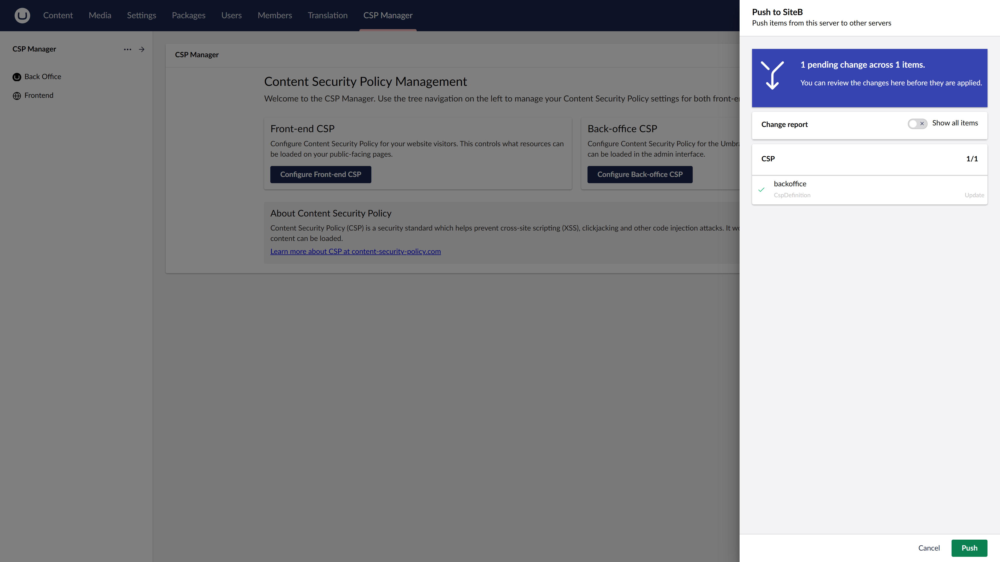
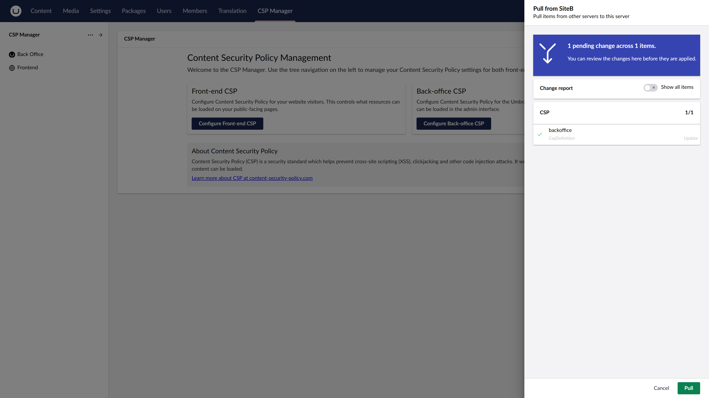

# uSync Complete (Publisher) Integration

[Umbraco.Community.CSPManager.uSync.Complete](https://www.nuget.org/packages/Umbraco.Community.CSPManager.uSync.Complete/) extends the [uSync integration](usync) with **push** and **pull** support via [uSync Publisher](https://www.nuget.org/packages/uSync.Complete/).

This allows you to push or pull CSP policies directly between live Umbraco environments on-demand from the backoffice — without running a full uSync export/import cycle.

## Requirements

- Umbraco 17.1+
- [Umbraco.Community.CSPManager](https://www.nuget.org/packages/Umbraco.Community.CSPManager/)
- [Umbraco.Community.CSPManager.uSync](https://www.nuget.org/packages/Umbraco.Community.CSPManager.uSync/)
- [uSync.Complete](https://www.nuget.org/packages/uSync.Complete/)

## Installation

Install this package in addition to the base uSync package:

```bash
dotnet add package Umbraco.Community.CSPManager.uSync.Complete
```

## Push and Pull Actions

Once installed, Push and Pull entity actions become available in the CSP Manager backoffice section.

**Push** — sends the selected CSP policy from your current environment to a remote Umbraco instance:



**Pull** — fetches a CSP policy from a remote Umbraco instance into your current environment:



These actions are available on both individual CSP policy items and the CSP Manager tree root.
