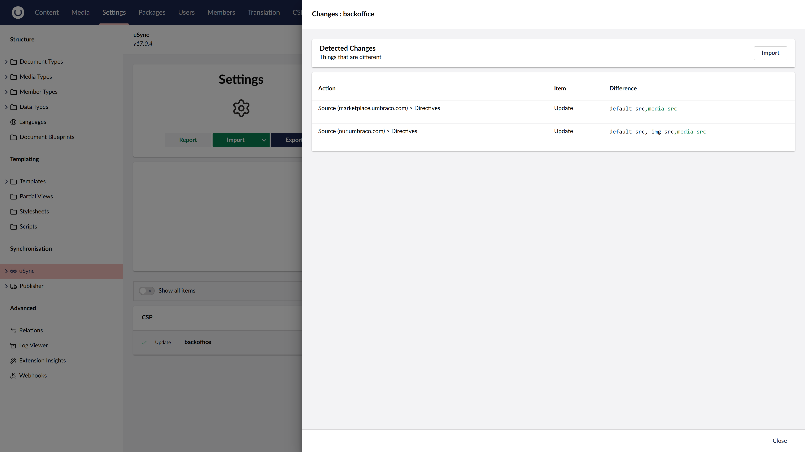

# uSync Integration

[Umbraco.Community.CSPManager.uSync](https://www.nuget.org/packages/Umbraco.Community.CSPManager.uSync/) adds support for synchronizing CSP policies across Umbraco environments using [uSync](https://github.com/KevinJump/uSync).

Once installed, uSync automatically includes your CSP definitions in its export/import cycle — syncing CSP configurations alongside your other Umbraco settings.

{: width="3840" height="2160" }

## Requirements

- Umbraco 17+
- [Umbraco.Community.CSPManager](https://www.nuget.org/packages/Umbraco.Community.CSPManager/) 17+
- [uSync.BackOffice](https://www.nuget.org/packages/uSync.BackOffice/) 17+

## Installation

```bash
dotnet add package Umbraco.Community.CSPManager.uSync
```

Or via the Package Manager Console:

```powershell
Install-Package Umbraco.Community.CSPManager.uSync
```

No further configuration is needed. After installation, CSP definitions appear in the uSync export/import cycle automatically.

## How It Works

The package registers a uSync serializer for `CspDefinition` objects. When uSync exports or imports settings, it includes the frontend and backoffice CSP policies. This means you can:

- Export CSP policies from one environment and import them into another via the uSync backoffice UI
- Include CSP policies in version-controlled uSync XML files
- Deploy CSP policy changes alongside code using your normal deployment pipeline
